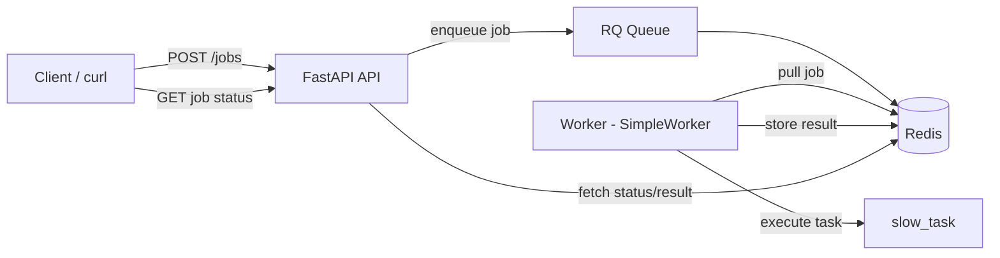

```mermaid
flowchart LR
  U[Client / curl] -->|POST /jobs| API[FastAPI API]
  API -->|enqueue job| Q[RQ Queue]
  Q --> R[(Redis)]
  W[Worker - SimpleWorker] -->|pull job| R
  W -->|execute task| T[slow_task]
  W -->|store result| R
  U -->|GET job status| API
  API -->|fetch status/result| R
```