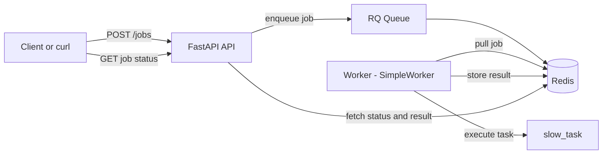

# bg-job-system

A minimal background job processing system built with **FastAPI**, **Redis**, and **RQ**.

## Features

- Submit background jobs through an API
- Process jobs asynchronously with a worker
- Check job status and result by job ID
- Simple architecture for learning async backend systems

## Architecture



## Project Structure

```text
bg-job-system/
├── app/
│   ├── jobs/
│   │   └── tasks.py
│   ├── workers/
│   │   └── redis_conn.py
│   └── main.py
├── worker.py
├── requirements.txt
└── README.md
```

## Installation

### 1. Clone the repository

```bash
git clone https://github.com/imane000/bg-job-system.git
cd bg-job-system
```

### 2. Install dependencies

```bash
pip install -r requirements.txt
```

### 3. Start Redis

Make sure Redis is running on `localhost:6379`.

If using Docker:

```bash
docker run -d --name redis-rq -p 6379:6379 redis:7
```

## Run the project

### Start the API

```bash
uvicorn app.main:app --reload
```

### Start the worker

```bash
python worker.py
```

## Test the API

### Create a job

```bash
curl.exe -X POST "http://127.0.0.1:8000/jobs?name=Imane"
```

### Check job status

```bash
curl.exe "http://127.0.0.1:8000/jobs/<JOB_ID>"
```

## Example Response

### Job creation

```json
{
  "job_id": "7e428436-9726-499a-887b-90122cde7abc",
  "status": "queued"
}
```

### Job completed

```json
{
  "job_id": "7e428436-9726-499a-887b-90122cde7abc",
  "status": "finished",
  "result": {
    "message": "Job done for Imane"
  }
}
```

## Notes

- On Windows, the worker uses `SimpleWorker` because the default RQ worker uses `os.fork()`, which is not available on Windows.
- This project is intentionally minimal and designed for learning purposes.
